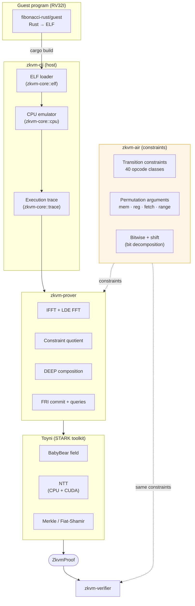

# zkvm

A small RISC-V (RV32I) zero-knowledge virtual machine, built on
[Toyni](https://github.com/jonas089/toyni) as its STARK proving backend.

> [!CAUTION]
> **This is research / hobby code.** It has **not** been audited and is
> not suitable for production use. Do not rely on it for any setting
> where a broken proof would have real-world consequences.

## Status

- **Toyni (proving backend)**: solid. Core STARK toolkit + CUDA NTT path.
- **zkvm (this repo)**: *the AIR / constraint system is still under
  review*. Substantial portions of the constraints were drafted with
  Claude's assistance and an audit-style survey has flagged several
  unresolved soundness gaps (load-value constraints disabled, range
  table not bound, public I/O not bound to memory, missing
  initial-state constraints, …). Until those are fixed, **assume the
  prover is unsound** and treat the project purely as a learning /
  research artefact.

## Architecture overview



The orange-highlighted `zkvm-air` block is the part that's currently
under audit. Everything below it (the prover pipeline, Toyni, the
verifier replay) follows the standard STARK shape and is in better shape
than the AIR itself.

## Crates

| Crate | Role |
|-------|------|
| `zkvm-core` | RV32I CPU emulator, ELF loader, trace generation, column layout |
| `zkvm-air` | Transition + permutation constraints over the trace columns |
| `zkvm-prover` | Two-phase commit → quotient → DEEP → FRI pipeline |
| `zkvm-verifier` | Fiat–Shamir replay, OOD constraint check, FRI query verification |
| `zkvm-io` | Public input / output tape helpers |
| `zkvm-host` | Host-side helpers shared by examples |
| `zkvm-cli` | `prove` / `verify` command-line entry point |
| `zkvm-guest` | `no_std` guest-side helpers (entry / commit / read) |

## Example

The Fibonacci example computes a Fibonacci value inside the zkvm and
proves the execution.

```bash
# Build the guest as a RISC-V ELF
cd examples/fibonacci-rust/guest
cargo build --release

# Run + prove (CPU only)
zkvm-cli prove target/riscv32i-unknown-none-elf/release/fibonacci-guest

# Or with the CUDA NTT backend (requires nvcc + a CUDA-capable GPU)
cargo install --path crates/zkvm-cli --features cuda
zkvm-cli prove target/riscv32i-unknown-none-elf/release/fibonacci-guest --cuda
```

## Development

```bash
cargo test
```
