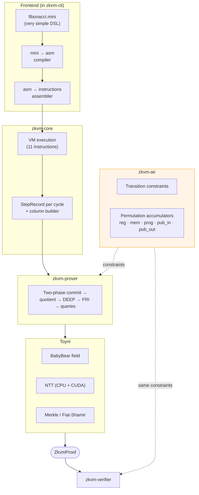

# zkvm

A small zero-knowledge virtual machine with a custom 11-instruction ISA,
built on [Toyni](https://github.com/jonas089/toyni) as its STARK
proving backend.

> [!CAUTION]
> **This is research / hobby code.** It has **not** been audited and is
> not suitable for production use. Do not rely on it for any setting
> where a broken proof would have real-world consequences.

## Status

- **Toyni (proving backend)**: solid. Core STARK toolkit + CUDA NTT path.
- **zkvm (this repo)**: *the AIR / constraint system is still under
  review*. Substantial portions of the constraints were drafted with
  Claude's assistance. The ISA is small enough to walk through end to
  end, but several deliberate v1 simplifications mean the prover is
  not strongly sound (see "Known soundness gaps" below).

Getting an instruction-set + AIR + proving pipeline right end-to-end is
genuinely ambitious for a single person. I'm working on it as a side
project, and external contributions, reviews, and bug reports are very
welcome. Open an issue or PR if you want to help close any of the gaps.

## The ISA in one page

Field-native: every register, memory cell, immediate, and PC value is a
BabyBear field element. There is no u32, no carries, no signed/unsigned,
no overflow.

- **8 registers** `r0..r7`. `r0` is hardwired to 0 (writes ignored).
- **Linear memory** addressed by field element (sparse; unwritten cells
  read as 0).
- **Public input/output tapes** consumed by `READ` and produced by `WRITE`.
- **PC advances by 1** per instruction; `JMP`/`JZ` use absolute targets.
- **Halt** via the `HALT` instruction.

| # | Mnemonic | Args | Effect |
|---|----------|------|--------|
| 1 | `ADD`   | `rd, ra, rb` | `rd = ra + rb` |
| 2 | `SUB`   | `rd, ra, rb` | `rd = ra - rb` |
| 3 | `MUL`   | `rd, ra, rb` | `rd = ra * rb` |
| 4 | `IMM`   | `rd, K`      | `rd = K` |
| 5 | `LOAD`  | `rd, ra`     | `rd = mem[ra]` |
| 6 | `STORE` | `ra, rb`     | `mem[ra] = rb` |
| 7 | `JMP`   | `label`      | `pc = label` |
| 8 | `JZ`    | `ra, label`  | if `ra == 0` then `pc = label` |
| 9 | `READ`  | `rd`         | `rd = next public input` |
| 10 | `WRITE`| `ra`         | append `ra` to public outputs |
| 11 | `HALT` |              | terminate |

The assembler also accepts `MOV rd, rs` as a pseudo-instruction
(expands to `ADD rd, rs, r0`).

## Architecture



## Crates

| Crate | Role |
|-------|------|
| `zkvm-core` | VM execution, step records, column layout, trace builder |
| `zkvm-air`  | Transition + accumulator constraints over the trace columns |
| `zkvm-prover` | Two-phase commit + quotient + DEEP + FRI + query pipeline |
| `zkvm-verifier` | Fiat-Shamir replay, OOD constraint check, FRI query verification, Lagrange-binding of the program ROM and public I/O tables |
| `zkvm-cli` | `prove` command, embedded assembler and `mini` compiler |

## The `mini` DSL

`mini` is a deliberately tiny language that maps 1:1 to asm. No nested
expressions, no functions, no types, no closures. Each statement is one
ALU op, one memory op, one I/O op, or one control-flow op.

```mini
let n = read();
let a = 0;
let b = 1;
let one = 1;
while n != 0 {
    let t = a + b;
    let a = b;
    let b = t;
    n = n - one;
}
write(a);
halt;
```

A maximum of 7 user variables (one per non-`r0` register). The compiler
is ~250 lines.

## Build and run

```bash
# Prove + verify the fibonacci example with input n=10
cargo run --release -p zkvm-cli -- prove examples/fibonacci.mini -i 10

# Or with the CUDA NTT backend (requires nvcc + a CUDA-capable GPU)
cargo run --release -p zkvm-cli --features cuda -- \
    prove examples/fibonacci.mini -i 10 --cuda

# Set ZKVM_DUMP_ASM=1 to print the generated assembly before running.
ZKVM_DUMP_ASM=1 cargo run --release -p zkvm-cli -- prove examples/fibonacci.mini -i 5
```

## Known soundness gaps (v1)

The AIR is small enough to walk through, but several simplifications mean
that a determined attacker can construct fake proofs without much effort.
These are deliberate scope limits for v1, not unknown bugs:

1. **Sorted-table ordering is not range-checked.** The register-file and
   memory consistency arguments rely on the prover providing an ordered
   sorted table, but nothing in the AIR forces the ordering to be
   monotone. A malicious prover can re-order entries within the same
   register/address to put a "read" before its "write".
2. **No initial-state binding.** The first sorted access for any
   register or memory address can claim arbitrary values. There is no
   constraint that uninitialised memory reads as 0 or that registers
   start at 0.
3. **Single-channel permutation arguments.** Each grand-product /
   LogUp argument uses one (γ, α) pair, giving roughly 2⁻³⁰ soundness
   instead of the 2⁻⁶⁰ that 4 channels would give.

For a learning project this is the deliberate "not strongly sound, but
not trivially broken" trade-off. Closing any of these is a self-contained
piece of work.

## Development

```bash
cargo test
cargo run --release -p zkvm-cli -- prove examples/fibonacci.mini -i 7
```
